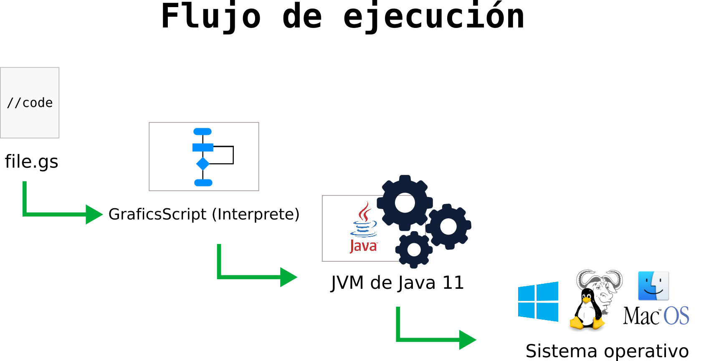
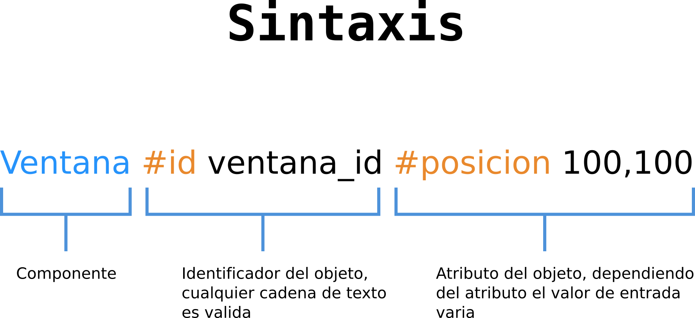
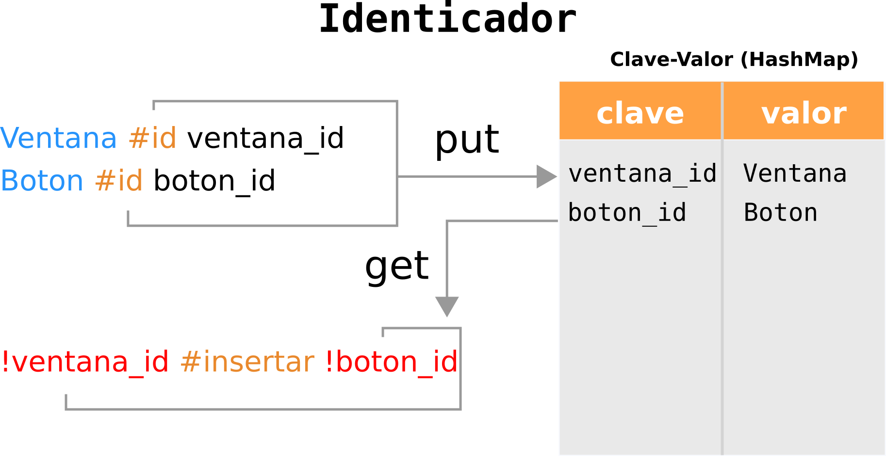
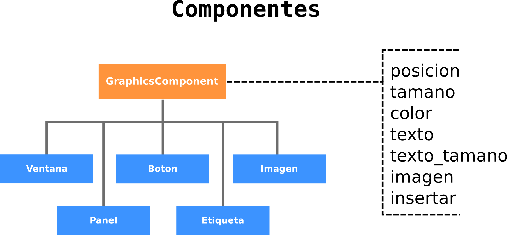
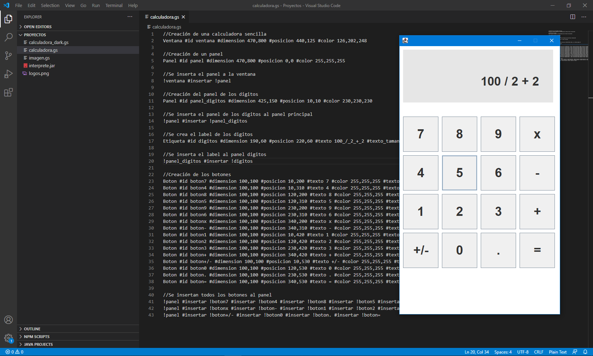
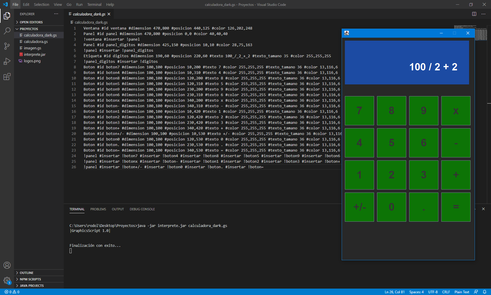
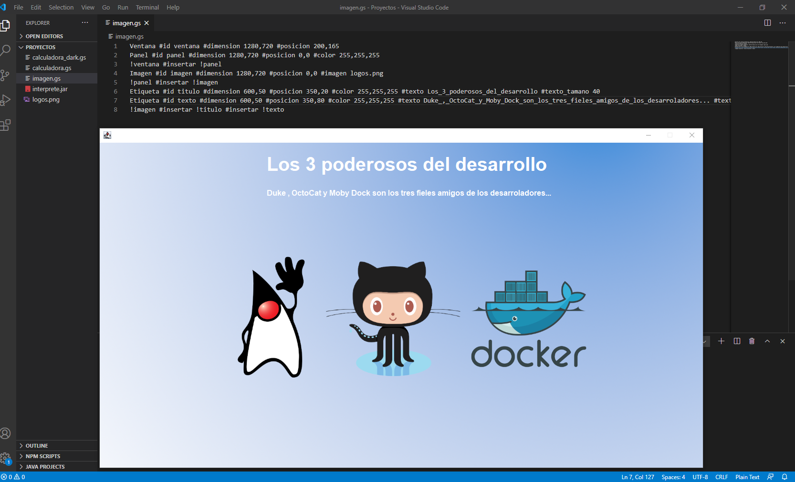

# GraphicScript
Primer prototipo de un interprete de código que recibe por nombre "GraphicScript", este proyecto se encuentra creado en Java 11 

  

## Documentación de GraphicScript

  

  

  

  

## Se adjuntan  capturas de pantalla de proyectos creados con el lenguaje GraphicScript

> Calculadora con tema blanco

  

> Calculadora con tema negro

  

> Ventana con una imagen de fondo y texto en la parte superior
